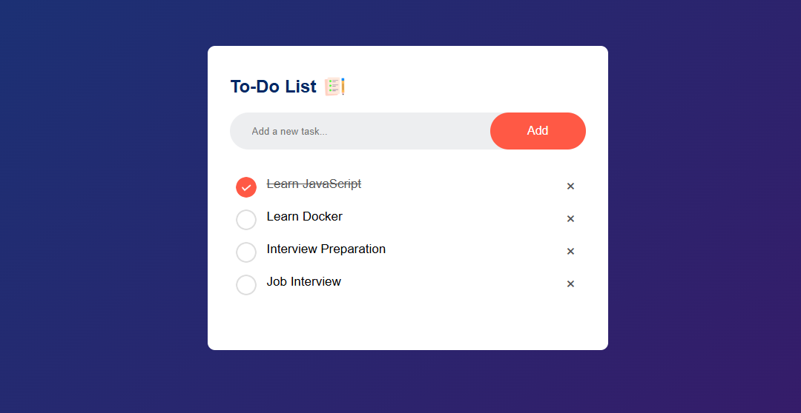

# Welcome to To-Do List 👋

> This project is a simple **To-Do List web application** built using **HTML, CSS, and JavaScript**.
It allows users to add, mark, and manage daily tasks efficiently.  

### 🏠 [Homepage](It allows users to add, mark, and manage daily tasks efficiently.)

## ⚙️ Features
- Add new tasks
- Mark tasks as completed
- Clean and responsive UI
- Browser-based storage (if applicable)

## 🛠️ Technologies Used
- HTML5
- CSS3
- JavaScript (ES6)

## ▶️ How to Run
1. Open the project folder in VS Code
2. Open `index.html`
3. Run with **Live Server**

## 📁 Project Structure

## Show your support
project/
│── index.html
│── style.css
│── script.js
└── README.md

## 📸 Screenshot

Give a ⭐️ if this project helped you!

***